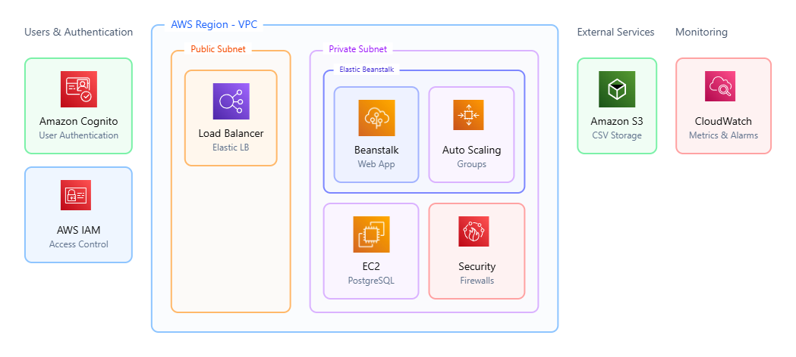
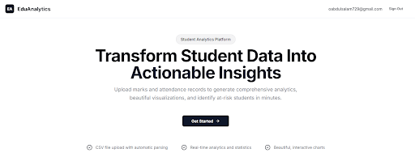
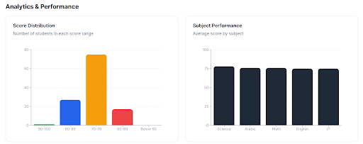

# <div align="center">EduAnalytics — Student Performance Analytics Platform</div>

<div align="center">
Transform raw student data into actionable insights. Upload marks and attendance CSV files to instantly generate comprehensive analytics, beautiful visualizations, and automatic at-risk student detection — built with Next.js 14, AWS Cognito, S3, and PostgreSQL.
</div>

## Built with the tools and technologies:

                

---


## Overview

**EduAnalytics** is a full-stack analytics platform for educators. Teachers create an analysis **session**, upload two CSV files — **marks** and **attendance** — and the platform immediately computes per-student and class-wide statistics, renders interactive charts, and flags students who are academically at risk. Every file is stored securely in **Amazon S3**, all metadata and computed analytics live in **PostgreSQL** (via Prisma), and authentication is handled end-to-end by **AWS Cognito** through NextAuth.

The app is deployed on **AWS Elastic Beanstalk** (Node.js 22 / Amazon Linux 2023) inside a VPC, and leans on a full suite of AWS services for compute, storage, security, and monitoring.

## Cloud Architecture



The platform runs entirely on AWS, with a clear separation between public-facing entry points and private compute/data resources inside a VPC:

- **Users & Authentication** — **Amazon Cognito** handles user sign-up and authentication, while **AWS IAM** governs access control and permissions across services.
- **Public Subnet** — An **Elastic Load Balancer (ELB)** is the single public entry point, distributing incoming traffic across application instances.
- **Private Subnet (Elastic Beanstalk)** — The Next.js **web app** runs on **AWS Elastic Beanstalk**, backed by **Auto Scaling Groups** that adjust capacity automatically under load. An **Amazon EC2** instance hosts the **PostgreSQL** database, and **Security Groups** act as virtual firewalls guarding the private resources.
- **Storage** — **Amazon S3** stores every uploaded CSV (marks and attendance records), referenced from the database by key.
- **Monitoring** — **Amazon CloudWatch** collects metrics and triggers alarms on the running infrastructure.

| Layer      | AWS Service            | Role                                 |
| ---------- | ---------------------- | ------------------------------------ |
| Compute    | Elastic Beanstalk      | PaaS hosting the Next.js web app     |
| Compute    | Amazon EC2             | Hosts the PostgreSQL database        |
| Compute    | Auto Scaling Groups    | Automatic capacity adjustment        |
| Networking | Elastic Load Balancing | Distributes traffic across instances |
| Storage    | Amazon S3              | Stores marks & attendance CSV files  |
| Security   | Amazon Cognito         | User authentication                  |
| Security   | AWS IAM                | Access control & permissions         |
| Security   | Security Groups        | Virtual firewall rules               |
| Monitoring | Amazon CloudWatch      | Metrics & alarms                     |

> The whole stack is provisioned inside an **AWS VPC**, isolating the database and application tier in a private subnet while exposing only the load balancer publicly.

## Features

- **🔐 Cognito Authentication** — Secure sign-in/sign-up backed by AWS Cognito, wired through NextAuth with JWT sessions and forced re-authentication.
- **📝 Guided Onboarding** — First-time users complete a profile (name, age, institution, position) before accessing the dashboard, enforced by middleware.
- **📊 Session Management** — Create, view, and delete multiple analysis sessions, each scoped to its owner and tracked with student/marks/attendance counts.
- **📤 CSV Upload & S3 Storage** — Marks and attendance files are validated, uploaded to Amazon S3 under a per-user/per-session key structure, and referenced from the database.
- **⚡ Automatic Analytics Engine** — On demand, CSVs are fetched from S3, parsed, and turned into rich analytics — average scores, attendance rates, per-subject and per-term breakdowns. Results are **cached** in the database as JSON for instant subsequent loads.
- **🎯 At-Risk Detection** — Students below **60%** average score or **75%** attendance are automatically flagged so educators can intervene early.
- **📈 Interactive Visualizations** — Score-distribution and subject-difficulty charts (Recharts), top-performer and at-risk tables, key-metric cards, and a full per-student performance table.
- **⬇️ Secure Downloads & Report Export** — Download original CSVs via time-limited S3 signed URLs (1-hour expiry) or export a complete JSON analytics report in one click.
- **🛡️ Admin Dashboard** — Email-allowlisted administrators get a protected dashboard showing live active sessions, authenticated user details, and the raw session payload.



## Tech Stack

- **Framework**: Next.js 14 (App Router), React 18, TypeScript
- **Styling**: Tailwind CSS, shadcn/ui, Radix UI primitives, Lucide icons
- **Authentication**: AWS Cognito via NextAuth.js (JWT strategy)
- **Database**: PostgreSQL with Prisma ORM
- **File Storage**: Amazon S3 (`@aws-sdk/client-s3` + presigned URLs)
- **Data Processing**: Papa Parse (CSV), custom analytics engine
- **Charts**: Recharts
- **Forms & Validation**: React Hook Form + Zod
- **Deployment**: AWS Elastic Beanstalk (Node.js 22, Amazon Linux 2023)

## How It Works

Marks and attendance CSVs are streamed from S3, parsed, and reduced into per-student and class-level analytics. Class analytics compute averages, a score-distribution histogram, subject difficulty, top performers, and the at-risk cohort — all in a single pass. Here is the core of the class-analytics reducer:

```typescript
// Group each student into a score bucket for the distribution histogram
Array.from(studentAnalytics.values()).forEach((s) => {
  if (s.averageScore >= 90) scoreDistribution["90-100"]++;
  else if (s.averageScore >= 80) scoreDistribution["80-89"]++;
  else if (s.averageScore >= 70) scoreDistribution["70-79"]++;
  else if (s.averageScore >= 60) scoreDistribution["60-69"]++;
  else scoreDistribution["Below 60"]++;
});

// Rank the top 5 performers and isolate the at-risk cohort
const topPerformers = Array.from(studentAnalytics.values())
  .sort((a, b) => b.averageScore - a.averageScore)
  .slice(0, 5);

const atRiskStudents = Array.from(studentAnalytics.values()).filter(
  (s) => s.isAtRisk,
);
```

The analytics API caches its result back into the session row, so charts load instantly on every subsequent visit:

```typescript
// Fetch both CSVs from S3 in parallel, then compute and persist analytics
const [marksCSV, attendanceCSV] = await Promise.all([
  fetchCSVFromS3(session.marksFileKey),
  fetchCSVFromS3(session.attendanceFileKey),
]);

const classAnalytics = calculateClassAnalytics(marksData, attendanceData);
const studentAnalytics = calculateStudentAnalytics(marksData, attendanceData);

// Cache the computed analytics as JSON so future loads skip re-processing
await prisma.session.update({
  where: { id: sessionId },
  data: { analytics, studentsCount: studentAnalytics.size },
});
```



## CSV File Format

The platform expects two CSV files per session with the following columns:

**Marks file**

```
student_id, student_name, class, subject, term, assessment_date, score, max_score
```

**Attendance file**

```
student_id, student_name, class, date, status
```

Attendance `status` values of `PRESENT` count toward each student's attendance rate.

## API Endpoints

### Authentication & User

- `GET|POST /api/auth/[...nextauth]` — NextAuth handler (Cognito sign-in, callback, session)
- `GET  /api/user/check` — Check whether the authenticated user exists / is onboarded
- `POST /api/user/onboarding` — Create the user profile and mark onboarding complete

### Sessions

- `GET    /api/sessions` — List the current user's sessions
- `POST   /api/sessions` — Create a session and upload marks + attendance CSVs to S3
- `GET    /api/sessions/[id]` — Fetch a single session (ownership-checked)
- `DELETE /api/sessions/[id]` — Delete a session
- `GET    /api/sessions/[id]/analytics` — Generate (or return cached) analytics for a session
- `GET    /api/sessions/[id]/download?type=marks|attendance` — Get a 1-hour S3 signed download URL

### Admin

- `GET  /api/admin/sessions` — List live active sessions (admin only)
- `POST /api/admin/sessions` — Heartbeat that registers the current session as active

## Data Model

Two Prisma models back the entire platform:

- **User** — Cognito-linked identity (`id` = Cognito sub), profile/onboarding fields, and a one-to-many relation to sessions.
- **Session** — Analysis session owning a class name, subject list, student/marks/attendance counts, S3 file keys, and a cached `analytics` JSON blob.

## Project Structure

```
eduanalytics/
├── app/
│   ├── page.tsx                      # Landing page
│   ├── onboarding/page.tsx           # First-time profile setup
│   ├── dashboard/                    # Dashboard + session views
│   │   └── sessions/[id]/page.tsx    # Session analytics detail
│   ├── admin/page.tsx                # Admin dashboard
│   └── api/                          # Route handlers (sessions, auth, admin, user)
├── components/
│   ├── charts/                       # Recharts visualizations & tables
│   ├── admin/                        # Active sessions table
│   ├── create-session-modal.tsx      # CSV upload modal
│   └── ui/                           # shadcn/ui component library
├── lib/
│   ├── analytics.ts                  # Core analytics engine
│   ├── s3-client.ts                  # S3 upload / signed URLs
│   ├── csv-parser.ts                 # Papa Parse helpers
│   ├── auth-config.ts                # NextAuth + Cognito config
│   └── auth-middleware.ts            # Auth / onboarding guards
├── prisma/schema.prisma              # User & Session models
└── [config files]
```

## Getting Started

```bash
npm install          # install dependencies (runs prisma generate)
npm run db:push      # sync the Prisma schema to your database
npm run dev          # start the dev server on http://localhost:3000
```

Provide a `.env` with your PostgreSQL, AWS Cognito, and S3 credentials (`DATABASE_URL`, `COGNITO_CLIENT_ID`, `COGNITO_CLIENT_SECRET`, `COGNITO_ISSUER`, `AWS_ACCESS_KEY_ID`, `AWS_SECRET_ACCESS_KEY`, `AWS_S3_BUCKET_NAME`, `AWS_REGION`, `NEXTAUTH_SECRET`, `ADMIN_EMAILS`).
